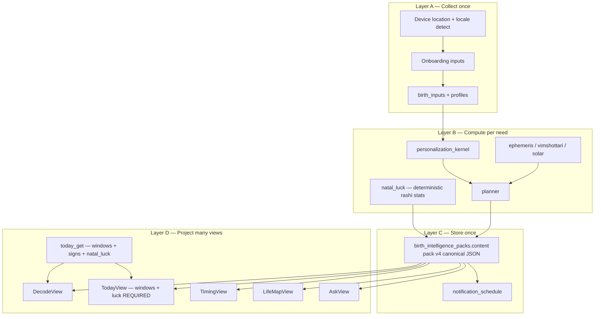
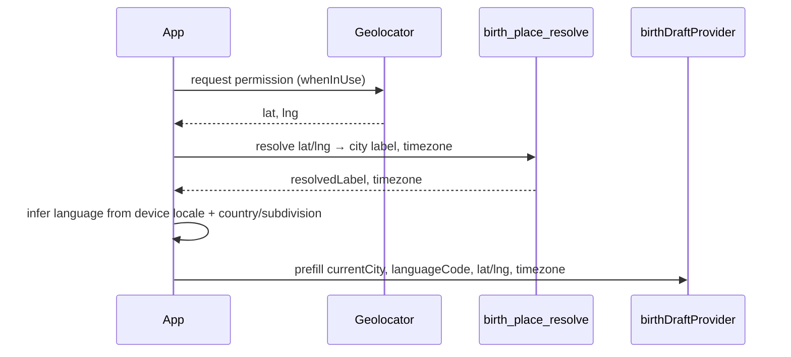

# V4 Centralization Plan (Phase 0–3)

**Status:** Draft for implementation  
**Scope:** Refactor through Phase 3 only — backend contract, DB cleanup, Flutter IA  
**Goal:** One rich personal dossier from one LLM call. Screens are **views**, not duplicate generators.

**Last updated:** Adds auto location/locale, mandatory daily timing windows, and centralized lucky attributes (numbers, days, colors).

---

## 1. Product thesis

We are **not** making the app thinner. We are making it **denser in one place** and **simpler everywhere else**.

| Wrong mental model | Right mental model |
|--------------------|--------------------|
| 24 JSON sections × 5 tabs = 120 cards of repeated phase talk | 1 canonical person model → each tab projects 4–6 cards |
| More tables = more product | More **fields on one record** = more product |
| Ask LLM the same life story 4 ways | Ask LLM once for **traits, chapters, happenings, playbooks** — UI filters |
| Ask user city + language manually | **Auto-detect** from device location + locale; user overrides in profile |
| Lucky numbers from LLM | **Deterministic** from birth moon rashi — one natal luck block, localized labels |

**Bloat removed:** duplicate storage paths, orphan tables, fallback chains, legacy APIs.  
**Depth kept (and expanded):** personality traits, life chapters, domain patterns, likely happenings, daily playbooks, remedies, ask knowledge.

**Non-negotiable daily utilities (must always show on Today):**

1. Good timing windows (clock times + why)  
2. Caution timing windows (clock times + label, incl. Rahu Kalam when applicable)  
3. Lucky numbers, lucky days, lucky colours (from **birth moon sign**, not LLM guesswork)

---

## 2. Centralization architecture

Everything flows through three layers. No screen talks to a legacy LLM path.



### Centralization rules (non-negotiable)

1. **One writer:** Only `ensureBirthPack()` + `generateBirthIntelligencePack()` write narrative copy.
2. **One reader (Flutter):** Only `birth_pack_get` reads narrative copy. Exception: `today_get` for live window times, moon/sign labels, and natal luck display.
3. **One invalidation:** `invalidateAllEngineCaches()` invalidates `birthPackProvider` + `todayPayloadProvider` + `remedyListProvider`.
4. **One card component family:** `MuhContentCard` + `MuhInsightList` — no `_V3ProseCard` / `_ShareableSignalCard` twins.
5. **One i18n path:** ARB l10n only — no `_V3Copy` parallel maps.
6. **Views never merge sources:** No `A if non-empty else B` across pack sections.
7. **Luck is deterministic:** Numbers/days/colours come from `vedic_labels.RASHI_STATS` via birth moon rashi — never from LLM.
8. **Windows are live:** Good/caution clock times always from `today_get` solar math for `profiles.current_lat/lng` + timezone.

---

## 3. Location & language auto-detection

Users should **not** have to type city or pick language on first open. Auto-fill, then allow override in onboarding and Profile Tune.

### 3.1 Design principles

| Principle | Implementation |
|-----------|----------------|
| Default silently | Pre-fill fields before user sees the form |
| Show what we guessed | Chip: “Using Hyderabad · Telugu” with Change |
| Never block onboarding | If permission denied → fallback to device locale + “India” city hint |
| Single source of truth | `profiles.current_city`, `current_lat/lng`, `current_timezone`, `language_code` |
| Pack follows profile | Language change → new pack locale row (existing model) |

### 3.2 Flutter: `LocationLocaleService` (new)

**Dependencies to add:** `geolocator`, `geocoding` (or reverse-geocode via existing `birth_place_resolve` edge action with lat/lng).

**Flow on onboarding open (`BirthBasicsScreen.initState`):**



**Language inference (deterministic, no LLM):**

| Signal | Default `language_code` |
|--------|-------------------------|
| Device `Locale.languageCode` is `te` | `te` |
| Device `Locale.languageCode` is `hi` | `hi` |
| Device in India + `te`/`hi` in preferred locales list | first Indian language match |
| `Platform.localeName` contains `IN` + Telugu script hint | `te` |
| Else | `en` |

Optional refinement (Phase 1): map geocoded `administrativeArea` → language prior:

- Telangana, Andhra Pradesh → prefer `te` if device not already `hi`  
- Hindi-belt states (UP, Bihar, MP, Rajasthan, etc.) → prefer `hi`  
- Metro default → `en` unless device locale says otherwise  

**UX on Birth Basics screen:**

```
Current city    [ Hyderabad          ]  📍 Detected
Language        [ Telugu ▾           ]  🌐 From your phone
```

- Tap 📍 → re-run detection  
- Language dropdown remains editable (updates `localeProvider` immediately for preview)  
- Birth place stays **manual** (usually different from current city)

### 3.3 Backend: extend `birth_place_resolve`

Already resolves place string → lat/lng/timezone. Add optional body fields:

```json
{ "lat": 17.38, "lng": 78.47 }
```

Return same shape: `resolvedLabel`, `lat`, `lng`, `timezone`. Keeps geocoding logic centralized server-side (Nominatim already in `geo_resolver.ts`).

### 3.4 Profile Tune & ongoing updates

| Event | Action |
|-------|--------|
| App resume (optional, Phase 3) | If city empty or “Detect again” tapped → refresh location |
| User edits city manually | Call `birth_place_resolve` → update lat/lng/timezone on save |
| User edits language | Update `language_code`, invalidate caches, regen pack for new locale |
| City/timezone change | Invalidate `todayPayloadProvider` (windows shift), not full pack unless birth data changed |

### 3.5 Schema (no new table)

Store detection metadata on `profiles`:

```sql
-- optional jsonb on profiles
location_meta jsonb default '{}'
-- { "source": "device_gps|manual|ip_fallback", "detected_at": "...", "admin_area": "Telangana" }
```

---

## 4. Daily timing windows (mandatory)

Good and caution windows are **core product**, not optional. Every Today view must render them when location is set.

### 4.1 What we show (Today tab — required cards)

| Card | Source | Empty state |
|------|--------|-------------|
| **Good windows rail** | `today_get.goodWindows[]` | “Set your city for timing” CTA → profile |
| **Caution windows rail** | `today_get.cautionWindows[]` | Same — never hide the section, show CTA |
| Window copy (why/best for) | `pack.playbook[date].*_window_notes` | Kernel fallback strings if pack note missing |

**Minimum bars:**

- At least **1 good window** and **1 caution window** row when solar data available (engine already produces multiple via `goodAndCautionWindows` in `solar.ts`).
- Show **clock times** in user timezone (`profiles.current_timezone`).
- Label caution windows plainly (Rahu Kalam, Yamagandam, etc. when applicable).

### 4.2 Computation (centralized, live)

```
sunriseSunset(date, current_lat, current_lng)
  → divideDaylight(slices)
  → goodAndCautionWindows(slices, tz)
  → decorate with pack.playbook[date].good_window_notes[i]
```

**Never** store window clock times in pack or dropped `timing_windows` table — location and date change them.

### 4.3 Notifications tied to windows

`notification_schedule` rows:

- `today_ready` — morning  
- `good_time_start` — first good window  
- `caution_start` — first caution window  

Requires Phase 0 fix (`confidence` on good window persist path). Notifications are **part of the windows product**, not separate.

### 4.4 QA acceptance (windows)

- [ ] Hyderabad user sees ≥1 good + ≥1 caution window for today  
- [ ] Changing current city in profile changes window times after refresh  
- [ ] Telugu locale: window labels localized via `vedic_labels` / l10n  
- [ ] Today tab never shows advice without windows section present  

---

## 5. Lucky numbers, days & colours (centralized)

Indian astrology apps expect **natal luck attributes** — we already have them in code (`vedic_labels.ts` → `RASHI_STATS`). Centralize and surface them; do **not** ask LLM to invent numbers.

### 5.1 Source of truth

| Field | Derived from | Code |
|-------|--------------|------|
| Birth moon rashi key | `birth_inputs` + ephemeris | `birthMoonDetails()` |
| Lucky numbers | `RASHI_STATS[rashi].luckyNumbers` | `vedic_labels.ts` |
| Lucky days | `RASHI_STATS[rashi].luckyDays` | weekday names localized |
| Lucky colours | `RASHI_STATS[rashi].goodColors` | colour names localized |

**Important:** Use **birth moon sign** (natal), not transit moon — luck is identity, not daily transit.

### 5.2 Canonical pack field: `person.natal_luck`

Filled at pack generation by **deterministic post-process** (not LLM):

```json
{
  "natal_luck": {
    "moon_sign_key": "kanya",
    "moon_sign_label": "కన్య",
    "lucky_numbers": ["5", "14", "23"],
    "lucky_days": ["బుధవారం", "శుక్రవారం"],
    "lucky_colours": [
      { "key": "green", "label": "ఆకుపచ్చ", "hex": "#2D6A4F" },
      { "key": "grey", "label": "బూడిద", "hex": "#6B7280" }
    ],
    "share_line": "నీ లక్కీ కలర్ ఈ రోజు green — ముఖ్యమైన కాల్ ముందు ధరించు."
  }
}
```

Post-process steps:

1. Parse `luckyNumbers` string → array of integers/strings  
2. Map `luckyDays` EN abbreviations → localized weekday names via `vedic_labels` helper  
3. Map `goodColors` → structured colour chips with hex for UI swatches  
4. LLM may write **`share_line` only** — numbers/days/colours are never model-generated  

### 5.3 `today_get` also returns `natal_luck`

For Decode moon header before pack loads:

```ts
natalLuck: {
  moonSign, luckyNumbers, luckyDays, luckyColours
}
```

Same object shape as pack — **one builder function** `buildNatalLuck(birthMoon, locale)` in backend.

### 5.4 UI surfaces

| Surface | What to show |
|---------|--------------|
| **Today** | `LuckyStrip` card: numbers as chips · days as pills · colour swatches — below main advice, above window rails |
| **Decode** | Compact row under moon header: “Luck: 5, 14 · Wed Fri · Green” |
| **Share card** | Optional `natal_luck.share_line` on share from Today |

**Widget:** `LuckyStrip` in `shared/widgets/` — single component, fed by `BirthPackViews.person.natalLuck` or `TodayPayload.natalLuck`.

### 5.5 Localization

Extend `vedic_labels.ts`:

- `luckyDaysLocalized(enDays: string, locale): string[]`  
- `luckyColoursLocalized(enColors: string, locale): { key, label, hex }[]`  

ARB keys for section title: `luckyNumbers`, `luckyDays`, `luckyColours` (already common in astrology apps).

### 5.6 What we do NOT do

- Do not add lucky numbers to `playbook` per day (repetitive, same natal stats daily)  
- Do not let LLM hallucinate “today’s lucky number 7”  
- Do not duplicate luck on Timing / Life Map tabs  

---

## 6. What we ask the user (inputs)

Collect **before** the one LLM call. More intent = richer dossier, not more API calls.

### 6.1 Auto-filled (user can change)

| Field | Auto source | Override |
|-------|-------------|----------|
| **Current city** | GPS → `birth_place_resolve` | Text field + re-detect |
| **Language** | Device locale + region heuristic | Dropdown |
| lat/lng/timezone | From resolve | Updated on city save |

### 6.2 Required manual

| Field | Why it matters |
|-------|----------------|
| Name | Personal voice, share cards |
| DOB | Age bracket, life-stage tone |
| Birth place | Geo, timezone, chart |
| Birth time / bucket / unknown | Engine mode, dasha precision |
| Nakshatra (known or unknown) | Archetype depth |

### 6.3 Add in onboarding (P1 — high conversion value)

| Field | Type | Steers LLM toward |
|-------|------|-------------------|
| **Main concern** (single pick) | enum | Which `domain_insights` get longest copy |
| **Life role** (single pick) | enum | Job vs business vs study vs family — examples in copy |
| **Upcoming event** (optional) | enum + date | `event_playbook` block for next 14 days |

**Main concern options**

- Why life feels stuck  
- Career timing  
- Money growth  
- Marriage / relationship  
- Family pressure  
- Business direction  
- Health / routine discipline  
- Good/bad time today  

**Life role options**

- Student / fresher  
- Early career (job)  
- Manager / senior IC  
- Business owner  
- Homemaker / family-first  
- Between jobs / pivoting  

**Upcoming event options** (optional)

- Interview · Manager talk · Payment follow-up · Travel · Exam · Family talk · Purchase · Launch · Property visit · Nothing now  

Store on `profiles.onboarding_intent jsonb` — single column, versioned.

### 6.4 Do not ask (infer from chart + kernel)

- Sun/Moon sign (computed)  
- Dasha periods (computed)  
- Lucky numbers / days / colours (computed from natal rashi)  
- Personality adjectives (LLM from nakshatra archetype + age)  
- Past happenings (LLM from phase facts + age)  
- Future themes (LLM from future dasha — non-creepy, thematic)  
- Good/caution window times (computed live)

---

## 7. What the LLM generates (canonical pack v4)

**Pack version:** `birth-pack:v4-central-dossier`

One JSON document. **Entities, not screens.** Each entity is rich; screens slice it.

### 7.1 `person` — traits & stable patterns

```json
{
  "display_hook": "string",
  "summary": "string",
  "moon_marker": "string",
  "archetype_label": "string",
  "traits": {
    "strengths": ["3–5"],
    "watchouts": ["2–3"],
    "daily_rhythm": "string",
    "stress_reset": "string",
    "speech_style": "string",
    "decision_style": "string"
  },
  "patterns": {
    "work_money": "string",
    "relationship": "string",
    "social_face": "string"
  },
  "natal_luck": { "... see §5.2 — filled deterministically" },
  "share_hook": "string"
}
```

### 7.2 `recognition` — past proof (Decode only)

2–3 cards. Free conversion. Not duplicated on Life Map.

### 7.3 `chapters` — full life timeline (single array)

One source for Life Map. No chapter prose on Decode/Timing.

### 7.4 `domain_insights` — deep reports (Pro-gated)

Six lenses. Main concern gets longest block.

### 7.5 `playbook` — daily timing **copy** only (30 days)

Map keyed by ISO date. **Copy only** — not clock times, not luck.

```json
{
  "2026-05-14": {
    "one_line": "string",
    "better_for": ["string"],
    "be_careful": ["string"],
    "good_window_notes": [{ "category", "why", "best_for", "avoid_for", "share_line" }],
    "caution_window_notes": [{ "category", "why", "best_for", "avoid_for", "share_line" }],
    "share_hook": "string"
  }
}
```

### 7.6 `horizons` — week & month (Timing tab only)

### 7.7 `remedies` — practical rituals

### 7.8 `event_playbook` — optional upcoming event

### 7.9 `ask` — template knowledge

### 7.10 `commercial` — paywall, share cards, notification copy

### 7.11 v3 → v4 duplicate removal

| v3 section | v4 replacement |
|------------|----------------|
| `user_identity` + `me_profile` + `free_preview` | `person` |
| `past_life_check` | `recognition` |
| `current_phase` + `timing_plan.current_phase` + `life_map.current_chapter` | `chapters[]` where `tense=current` |
| `life_map` + `journey_phases` | `chapters[]` |
| `today_guidance` + `today_cards[]` | `playbook` |
| `weekly_cards` + `timing_plan.week` | `horizons.week` |
| `monthly_cards` + `timing_plan.month` | `horizons.month` |
| `likely_life_events` | `chapters[].happenings` |
| `remedy_cards` + `remedy_pack` | `remedies` |

---

## 8. What each screen shows (view projections)

| Tab | Job | Pack | Live API |
|-----|-----|------|----------|
| **Decode** | “Who am I?” | `person`, `recognition` | `today_get` → moon/sign + `natal_luck` compact |
| **Today** | “What do I do now?” | `playbook[date]`, `remedies[0]`, `event_playbook` | `today_get` → **windows (required)** + `natal_luck` strip |
| **Timing** | “Plan week/month” | `horizons.week`, `horizons.month` | — |
| **Life Map** | “My life story” | `chapters` by `tense` | — |
| **Ask** | “Answer this” | `ask` | `ask` action |

### Today tab layout (fixed order)

```
1. Main advice          (playbook.one_line)
2. LuckyStrip           (natal_luck — numbers, days, colours)
3. Good windows rail    (today_get — REQUIRED)
4. Caution windows rail (today_get — REQUIRED)
5. Better for / Be careful (playbook)
6. Remedy card
7. Event playbook card  (if within 7 days)
```

### Anti-repetition matrix

| Concept | Appears on |
|---------|------------|
| Personality traits | Decode only |
| Past recognition | Decode only |
| Life chapter story | Life Map only |
| Week / month plan | Timing only |
| Daily one-liner | Today only |
| Lucky numbers/days/colours | Today (full) + Decode (compact) — same data, different density |
| Window clock times | Today only |
| Domain deep report | Decode teaser OR Pro — one surface |

---

## 9. Live compute boundary

| Data | Source | In pack? |
|------|--------|----------|
| Good/caution **clock times** | `today_get` | **No** — live |
| Window **copy** (why/best for) | `playbook[date]` | **Yes** |
| Transit moon | `today_get` | No |
| Birth moon / sun | `today_get` | No |
| **Natal luck** | `buildNatalLuck()` | **Yes** (deterministic snapshot) + returned on `today_get` |
| Dasha lords at date | kernel / today_get | Lords in API; story in pack |

---

## 10. Phase 0 — Stabilize (1–2 days)

| # | Task |
|---|------|
| 0.1 | Fix `confidence` on good window inserts; split persist so `notification_schedule` succeeds |
| 0.2 | `birth_pack_get`: accept `status IN ('ready','fallback')` |
| 0.3 | `invalidateAllEngineCaches` includes `birthPackProvider` |
| 0.4 | Today: single copy source (`today_cards[date]` / future `playbook`) |
| 0.5 | Decode: drop `me_profile` fallback + `current_phase` card |
| 0.6 | **Today: never hide window rails** — empty state → “Add city for timing” |
| 0.7 | Expose `natal_luck` on `today_get` via `buildNatalLuck()` + show `LuckyStrip` on Today |

**Exit criteria:** Notifications populate; Today always shows windows section + lucky strip; one advice line.

---

## 11. Phase 1 — Pack v4 + location/intent (5–7 days)

### 11.1 Backend

| # | Task |
|---|------|
| 1.1 | `onboarding_intent jsonb` on `profiles` |
| 1.2 | `birth-pack:v4-central-dossier` prompt + entities |
| 1.3 | `buildNatalLuck()` + attach to `person.natal_luck` on every pack |
| 1.4 | `birth_place_resolve` accepts `{ lat, lng }` reverse geocode |
| 1.5 | `ensurePackCoverage()` + `ensureOpenerVariety()` |
| 1.6 | `fact_signature` without `dateStr` — one pack per profile/birth/locale |
| 1.7 | v3 → v4 adapter |

### 11.2 Flutter

| # | Task |
|---|------|
| 1.8 | Add `geolocator` + permission flow |
| 1.9 | `LocationLocaleService` — auto city + language on onboarding |
| 1.10 | Birth Basics UX: show detected city/language chips |
| 1.11 | Main concern + life role screens |
| 1.12 | Optional upcoming event |
| 1.13 | `LuckyStrip` widget (numbers, days, colour swatches) |
| 1.14 | Localize lucky day/colour names te/hi/en |

### 11.3 Depth checklist

- [ ] `person.display_hook` specific to nakshatra + age  
- [ ] `recognition` ≥ 2 cards  
- [ ] All dasha chapters present  
- [ ] `playbook` 30 distinct openers  
- [ ] `natal_luck` matches birth moon rashi in chart_runs  
- [ ] Windows render for detected Hyderabad default  

---

## 12. Phase 2 — DB & API centralization (2–3 days)

| # | Task |
|---|------|
| 2.1 | Slim `today_get`: windows + signs + lords + `natal_luck` — no narrative cache |
| 2.2 | Remove legacy actions (quick_proof, journey_get, weekly_get, etc.) |
| 2.3 | Notifications only persist path (drop screen_cards/timing_windows writes) |
| 2.4 | Migration: drop orphan tables |

**`today_get` response (final):**

```ts
{
  date, locale, locationLabel,
  birthMoonSign, birthMoonNakshatra, sunSign, moonSign, moonNakshatra,
  mahadashaLord, antardashaLord,
  natalLuck: { luckyNumbers, luckyDays, luckyColours, moonSignLabel },
  goodWindows: DecoratedWindow[],
  cautionWindows: DecoratedWindow[],
}
```

---

## 13. Phase 3 — Flutter centralization (4–5 days)

| # | Task |
|---|------|
| 3.1 | Delete dead screens/providers |
| 3.2 | `BirthPackViews` projection layer |
| 3.3 | Split `home_shell.dart` into tab files |
| 3.4 | Today tab fixed layout (§8) with `TimeWindowRail` + `LuckyStrip` |
| 3.5 | Profile Tune: re-detect location button |
| 3.6 | Router: land on Decode; rename tab query params |
| 3.7 | Migrate `_V3Copy` → ARB |

**Exit criteria:** `home_shell.dart` < 400 lines; Today always shows luck + windows; location auto-fill works on fresh install.

---

## 14. PR sequence (updated)

| PR | Phase | Description |
|----|-------|-------------|
| PR1 | 0 | Notification/persist fix |
| PR2 | 0 | Pack gate + cache invalidation |
| PR3 | 0 | Today single-source + **mandatory window rails** |
| PR4 | 0 | `buildNatalLuck` + `LuckyStrip` on Today/Decode |
| PR5 | 1 | `LocationLocaleService` + geolocator |
| PR6 | 1 | `birth_place_resolve` lat/lng + onboarding UX |
| PR7 | 1 | `onboarding_intent` + concern/role screens |
| PR8 | 1 | Pack v4 + `person.natal_luck` post-process |
| PR9 | 1 | `BirthPackViews` + v3 adapter |
| PR10 | 2 | Slim `today_get` + drop legacy APIs |
| PR11 | 2 | DB migration |
| PR12 | 3 | Split home + dead code removal |
| PR13 | 3 | l10n + router |

---

## 15. Success metrics

| Metric | Target |
|--------|--------|
| Onboarding city/language manual entry rate | < 20% (most users keep auto-detect) |
| Today sessions with ≥1 good + ≥1 caution window | 100% when city set |
| `natal_luck` displayed on Today | 100% |
| Lucky data matches `RASHI_STATS` for natal rashi | 100% (automated test) |
| Packs per user per locale | 1 active |
| Same phase sentence on 2 tabs | 0 |
| `playbook` day coverage | 30/30 |

---

## 16. Open decisions

| # | Decision | Recommendation |
|---|----------|----------------|
| 1 | Domain insights on Decode vs Reports tab | Decode teaser only in Phase 3 |
| 2 | Re-detect location on every app open | No — on onboarding + manual only |
| 3 | IP-based city fallback if GPS denied | Phase 1 optional: coarse timezone from device + “India” default |
| 4 | Daily transit luck vs natal luck | **Natal only** for v4; daily transit luck is Phase 4+ if needed |
| 5 | Hindi pack on language switch | Yes — new pack row per locale |

---

## 17. References

- `supabase/functions/muhurtha-api/vedic_labels.ts` — `RASHI_STATS`, `rashiDisplay()`  
- `supabase/functions/muhurtha-api/solar.ts` — `goodAndCautionWindows()`  
- `supabase/functions/muhurtha-api/geo_resolver.ts` — Nominatim resolve  
- Live DB audit: notification bug, 6 packs / 1 user  
- `docs/upgrades/v3.md`, `.cursor/rules/ui-copy-no-repeat.mdc`
